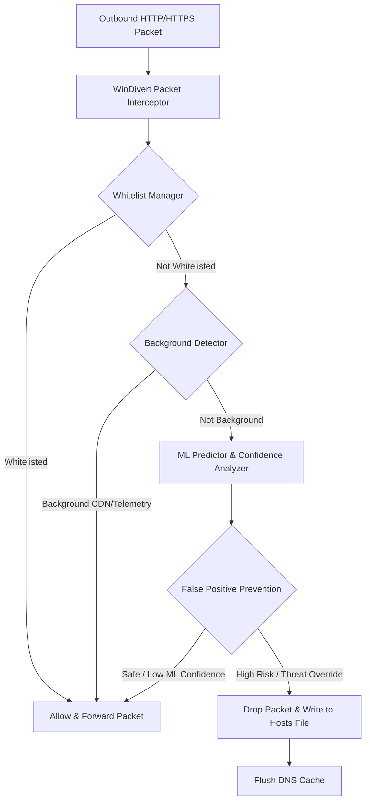

# AI-Powered System Web Blocker

An offline, kernel-level network packet interceptor and hybrid machine learning web blocker for Windows. The application captures outbound HTTP/HTTPS packets system-wide, parses the target domain name, and evaluates the domain's risk in real time using a pre-trained offline machine learning classifier integrated with a robust heuristic verification engine.

---

## Key Features

1.  **System-Wide Interception**: Uses the Windows kernel-level `WinDivert` driver to capture outgoing traffic on ports 80 (HTTP) and 443 (HTTPS) across all browsers and desktop applications.
2.  **Hybrid Heuristic Engine**: Combines offline Machine Learning (TF-IDF vectorizer + Support Vector Machine or Random Forest model) with advanced structural domain analysis:
    *   **Shannon Entropy Analysis**: Detects random strings typical of Domain Generation Algorithms (DGA) and malware command-and-control servers.
    *   **Phishing Substring Search**: Flags brand impersonation and high-risk terms (e.g. `login`, `secure`, `banking`, `verify`).
    *   **Complexity Scans**: Analyzes subdomain depth and abnormal domain length.
3.  **False Positive Prevention**: Prevents safe systems from blocking critical developer utilities (such as low-confidence false-positive classifications on `github.com`).
4.  **Structured Whitelist Manager**: Supports wildcard domain matching (e.g., `*.google.com`, `*.live.com`) for system services and critical operating system updates.
5.  **Background Process Recognition**: Automatically identifies and allows telemetry, OS updates, browser metrics, and CDN assets to prevent blocking safe background traffic.
6.  **Windows Hosts Integration**: Redirects blocked domains to `127.0.0.1` locally, caching the DNS resolution system-wide.

---

## File and Component Structure

*   `main.py`: Interactive console interface containing configuration menus, history logs, model testing, and blocker controls.
*   `click_blocker.py`: Manages the outbound packet interception daemon and hooks into the decision engine.
*   `false_positive_prevention.py`: The hybrid threat decision coordinator containing entropy algorithms, substring keywords, and ML classification thresholds.
*   `whitelist_manager.py`: Manages wildcard matching, system whitelists, and user whitelists.
*   `background_detector.py`: Scans domains for common background telemetry and update CDN networks.
*   `hosts_manager.py`: Adds or removes local redirects inside `C:\Windows\System32\drivers\etc\hosts` and flushes the local DNS cache.
*   `model_loader.py`: Handles vectorization (`vectorizer.pkl`) and inference calls to the model binary (`model.pkl`).
*   `confidence_analyzer.py`: Extracts probability scores from the local classification model.
*   `logger.py`: Implements a safe print interface that prevents Unicode rendering crashes on standard Windows terminals.
*   `test_features.py`: Automated integration and unit test suite verifying all engine subsystems.
*   `test_model.py`: Test suite validating ML prediction performance against mock domains.

---

## Installation & Setup

### Prerequisites
*   Windows OS.
*   Python 3.7 or newer.
*   Administrative privileges (required to interact with raw socket drivers and the hosts file).

### Install Dependencies
Open standard Command Prompt or PowerShell **as Administrator** and run:
```powershell
pip install -r requirements.txt
```
*Note: This installs `pydivert` (Python bindings for WinDivert), `scikit-learn`, `numpy`, and `pandas`.*

---

## Execution Guide

### 1. Launching the Blocker
Open PowerShell **as Administrator** and run the main entry script:
```powershell
python main.py
```

Select from the interactive menu options:
*   **Option 2 (Enhanced Click-Based Blocker)**: Launches the recommended blocking daemon utilizing the hybrid heuristic and ML engine.
*   **Option 4 (Test Model)**: Executes the machine learning model validation tests to verify inference outputs.
*   **Option 5 (Unblock Manager)**: Prompts to safely unblock a previously restricted domain.
*   **Option 6 (View Block History)**: Prints the log of allowed and blocked sites with their corresponding reasons and confidence metrics.

### 2. Running the Test Suite
To execute the automated unit and integration tests, run:
```powershell
python test_features.py
```

---

## How It Works


